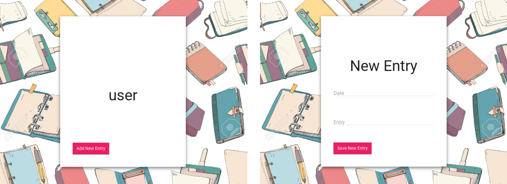

# UNIT3
# Diary App
## Criteria A: Planning
### Context of the problem
Many people like to keep diaries to document important events of their lives. However, paper diaries are old-school and take a lot of storage space [1].This project is a Diary App. It allows the user to keep a personal digital diary on their phone through an app. The user keeps their entries secure by creating an account and accessing their personal portal which allows them to enter and read diaries according to the date. <br>

[1] Adminassistance. “What Type Of Diary Is Better To Use?” Admin Assistance, 16 Sept. 2020, www.adminassistance.co.uk/diaries-online-vs-paperback.  <br>

To support this idea, I received a request from my roomate asking about an app to record her diary entries since her physical journal is taking too much space in her small dorm room (see appendix). <br>

### Justification of the solution
We will create an app program using Python as a programming language on the programming software PyCharm that is available by our school. We will be using the open source KivyMD in order to build our app interface and components. In fact, KivyMD is one of the most useful sources that makes app development on Python much easier and efficient [2]. We will also use SQL programming language to build 2 databases for the app: a database to store the user's account information and a database to store the journal entries of each user. The app will have 4 main screens: a registration screen, login screen, diary entries screen and a diary entries view screen. <br>

[2] Gupta, Kaustubh. “Building Android Apps With Python: Part -3.” Medium, Towards Data Science, 4 Dec. 2020, towardsdatascience.com/building-android-apps-with-python-part-3-89a455ee7f7c. <br>

T.E.L.O.S. Study: <br>
T-Technical-Is the project technically possible? We dispose of a computer and PyCharm software for Python and KivyMD code. All technical necessities for this project are satisfied. <br>
E-Economic- Can the project be afforded? Will it increase profit? This project is developed for free by UWC ISAK Japan students. Thanks to the funding provided to our school, we can afford all of the components necessary for the project. <br>
L-Legal- Is the project legal? The project is completely legal as the 1947 Japanese constitution does not criminalize small digital projects like ours. <br>
O-Operational- How will the current operations support the change? The project will operate on a computer and displayed on a phone. The process does not have any errors and is perfectly operational. <br>
S-Scheduling- Can the project be done in time? We are given 3 weeks to complete this project and the tasks have been regularly distributed to assure that it is completed by Thursday, April 1st, 2021. <br>
### Criteria for success
1. The product should allow the customer to store their account info and diary entries. <br>
2. The product contains a login feature. <br>
3. The product contains a register feature. <br>
4. The product should have a pink theme. <br>
## Criteria B: Design
### Test Plan 
|                                       Test                                       |                                                           Expected Outcome                                                           | Met? |
|:--------------------------------------------------------------------------------:|:------------------------------------------------------------------------------------------------------------------------------------:|:----:|
| Crit.1. The product should allow the customer to store their account info and diary entries.               | The product contains 2 database tables: 1 database to store user account information and 1 database to store each user's diary entries.                                                              | YES  |
| Crit.2. The product contains a login feature.               | When you open the app, you can enter your email and password in the allocated fields and you get signed in when you click the "sign in" button.                                                              | YES  |
| Crit.3. The product contains a register feature. | You can enter an email and password in the allocated fields and your account gets added to the users database when you click the "register" button.                                                       | YES  |
| Crit.4. The product should have a pink theme. | The app's theme has been set at the colour pink which is visible in the background and buttons.                                                       | YES  |
### Initial Sketches
I started by making some initial sketches of each screen of the app. It shows the components and its location on each screen. These sketches will be later used as a refrence when coding the app's screens. <br>
 <br>
**Fig. 1:** Initial Paper Sketches of the App <br>
<br>
The app contains 2 database tables: the users table to store the users' accounts information and the diary table to store the diary entries of each user. These are the Entity Relationships (ER) diagrams for the 2 database tables of the app. <br>
 <br>
**Fig. 2:** ER Diagrams of our 2 database tables <br>
### User Interface
This is the Home Login Screen and Register Screen of the app. <br>
 <br>
**Fig. 3:** Login and Register Screens <br>
<br>
This is the Diary Entries Screen which allows the user to enter their journal entries after they have logged-in. <br>
 <br>
**Fig. 4:** Diary entries Screen <br>
<br>
The following are the 2 database tables with some data in them. The app allows us to write and read from them using the sign-in/register and diary entry functions. <br>
 <br>
**Fig. 5:** 2 database tables of the app <br>
## Criteria C: Development
We ended up with the following Python code which will be run on PyCharm: <br>
```py
import sqlite3
from kivymd.app import MDApp
from kivymd.uix.screen import MDScreen
from kivy.uix.behaviors import ButtonBehavior
from kivymd.uix.label import MDLabel


class MainApp(MDApp):
    def build(self):
        self.theme_cls.primary_palette = 'Pink'

        return


class DiaryScreen(MDScreen):
    pass


class EntryScreen(MDScreen):
    def new_entry(self):
        date = self.ids.date_input.text
        entry = self.ids.entry_input.text

        conn = sqlite3.connect("app.sqlite")
        sql = f"insert into diary(date, entry) values ('{date}', '{entry}');"
        cur = conn.cursor()
        cur.execute(sql)
        print("New Entry Created")
        conn.commit()
        conn.close()


class LoginScreen(MDScreen):
    def try_login(self):
        email = self.ids.email_input.text

        password = self.ids.password_input.text

        conn = sqlite3.connect('app.sqlite')
        sql = f"select * from users where email='{email}' and password='{password}';"
        cur = conn.cursor()
        cur.execute(sql)
        result = cur.fetchone()
        conn.close()
        print(result)
        id, password, email = result
        print(f"login successful for user with id {id} and email {email}")


class RegisterScreen(MDScreen):
    def try_register(self):
        email = self.ids.email_input.text
        password = self.ids.password_input.text
        password_check = self.ids.password_input.text
        if password != password_check:
            print("Passwords do not match")
        else:
            # check the user is not registered already
            conn = sqlite3.connect('app.sqlite')
            sql = f"select * from users where email='{email}' and password='{password}';"
            cur = conn.cursor()
            cur.execute(sql)
            result = cur.fetchone()

            conn = sqlite3.connect("app.sqlite")
            sql = f"insert into users(email, password) values ('{email}', '{password}');"
            cur = conn.cursor()
            cur.execute(sql)
            print("User created")
            conn.commit()
            conn.close()


class ButtonLabel(ButtonBehavior, MDLabel):
    pass


MainApp().run()
``` 
The following is the KivyMD code file to customize the app components: 
```py
ScreenManager:
    id: scr_manager

    LoginScreen:
        name:'LoginScreen'

    RegisterScreen:
        name:'RegisterScreen'

    EntryScreen:
        name:'EntryScreen'

    EntryScreen:
        name:'DiaryScreen'

<DiaryScreen>:
    BoxLayout:
        orientation:'vertical'
        size: root.height, root.width

        FitImage:
            source: 'diary.jpg'

    MDCard:
        size_hint: 0.5, 0.8
        elevation: 10
        pos_hint: {'center_x':0.5, 'center_y':0.5}
        orientation: 'vertical'
        padding: dp(40)
        spacing: dp(40)

        MDBoxLayout:
            id: content #id or name
            adaptive_height: True
            orientation: 'vertical'
            padding: dp(30)
            spacing: dp(20)

        MDLabel:
            text: 'My Diary'
            font_style: 'H3'
            halign: 'center'

        MDRaisedButton:
            text: 'Add New Entry'
            on_press:
                root.parent.current = 'EntryScreen'

<EntryScreen>:
    BoxLayout:
        orientation:'vertical'
        size: root.height, root.width

        FitImage:
            source: 'diary.jpg'

    MDCard:
        size_hint: 0.5, 0.8
        elevation: 10
        pos_hint: {'center_x':0.5, 'center_y':0.5}
        orientation: 'vertical'
        padding: dp(40)
        spacing: dp(40)

        MDBoxLayout:
            id: content #id or name
            adaptive_height: True
            orientation: 'vertical'
            padding: dp(30)
            spacing: dp(20)

        MDLabel:
            text: 'New Entry'
            font_style: 'H3'
            halign: 'center'

        MDTextField:
            id: date_input
            hint_text: 'Date'
            icon_left: 'date'
            required: True

        MDTextField:
            id: entry_input
            hint_text: 'Entry'
            icon_left: 'entry'
            required: True

        MDRaisedButton:
            text: 'Save New Entry'
            on_release:
                root.new_entry()
            on_press:
                root.parent.current = 'DiaryScreen'

<RegisterScreen>:
    BoxLayout:
        orientation:'vertical'
        size: root.height, root.width

        FitImage:
            source: 'diary.jpg'

    MDCard:
        size_hint: 0.5, 0.8
        elevation: 10
        pos_hint: {'center_x':0.5, 'center_y':0.5}
        orientation: 'vertical'

        MDBoxLayout:
            id: content #id or name
            adaptive_height: True
            orientation: 'vertical'
            padding: dp(30)
            spacing: dp(20)

            MDLabel:
                text: 'REGISTER'
                font_style: 'H3'
                halign: 'center'

            MDTextField:
                id: email_input
                hint_text: 'Email'
                icon_left: 'email'
                helper_text: 'Invalid email'
                helper_text_mode:'on_error'
                required: True

            MDTextField:
                id: password_input
                hint_text: 'Password'
                icon_left: 'key'
                helper_text: 'Invalid password'
                helper_text_mode:'on_error'
                required: True
                password: True
                password_mask: '*'

            MDRaisedButton:
                text: 'Register'
                on_release:
                    root.try_register()
                    root.parent.current = 'LoginScreen'

            MDBoxLayout:
                adaptive_height: True
                ButtonLabel:
                    text: 'Diary'
                    on_press:
                        root.parent.current = 'DiaryScreen'


<LoginScreen>:
    BoxLayout:
        orientation:'vertical'
        size: root.height, root.width

        FitImage:
            source: 'diary.jpg'

    MDCard:
        size_hint: 0.5, 0.8
        elevation: 10
        pos_hint: {'center_x':0.5, 'center_y':0.5}
        orientation: 'vertical'

        MDBoxLayout:
            id: content #id or name
            adaptive_height: True
            orientation: 'vertical'
            padding: dp(30)
            spacing: dp(20)

            MDLabel:
                text: 'MyDiary'
                font_style: 'H3'
                halign: 'center'
                font_size: '50sp'

            MDTextField:
                id: email_input
                hint_text: 'Email'
                icon_left: 'email'
                helper_text: 'Invalid email'
                helper_text_mode:'on_error'
                required: True

            MDTextField:
                id: password_input
                hint_text: 'Password'
                icon_left: 'key'
                helper_text: 'Invalid password'
                helper_text_mode:'on_error'
                required: True
                password: True
                password_mask: '*'

            MDRaisedButton:
                text: 'Log in'
                on_release:
                    root.try_login()
                    root.parent.current = 'DiaryScreen'

            MDBoxLayout:
                adaptive_height: True
                ButtonLabel:
                    text: 'Register'
                    on_press:
                        root.parent.current = 'RegisterScreen'


```
This is the SQLite code for our 2 databases:
```py
# User Information Database
CREATE TABLE IF NOT EXISTS users(
    id       integer primary key autoincrement,
    email    varchar(250),
    password varchar(40)
);

# Diary Entries Database
CREATE TABLE IF NOT EXISTS diary(
    id integer primary key autoincrement,
    date Date,
    entry varchar(200)
)
```
## Criteria D: Functionality
The functionality of the app has been presented in class.
## Criteria E: Evaluation
The app functions pretty well. The database portion is functionning successfully. When you register, it writes your email and associated password in the users database table so that next time when you sign-in, it checks that your account information is available and links you to the diary screen. The diary screen allows you to enter a journal entry with the date associated. However, I struggled to make the entries appear in another screen. The only way to access previous entries is to look at the diary database table which is quite inconvenient and has to be improved. Overall, the success criteria has been met although the app might need some improvements. It is generally a good introduction and practise of app development using KivyMD.

## Appendix
 <br> 
**Fig. 6:** Customer requests conversation proof <br>
