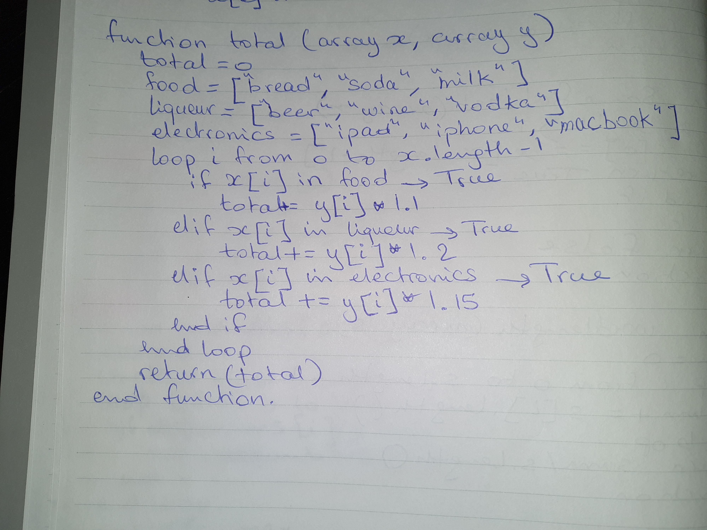
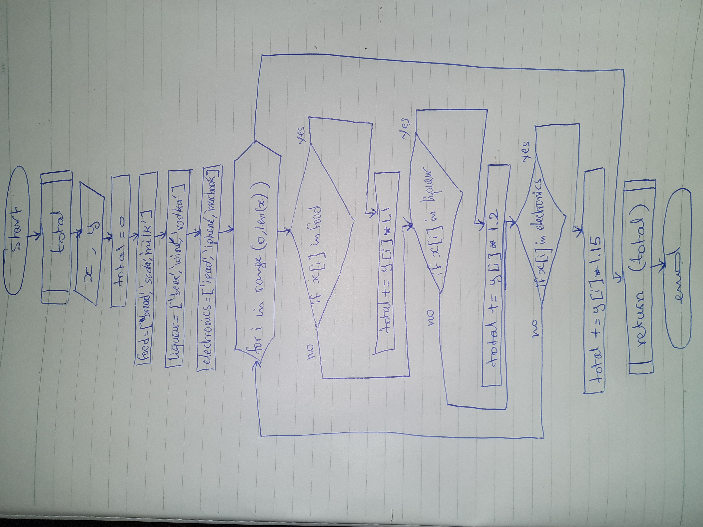
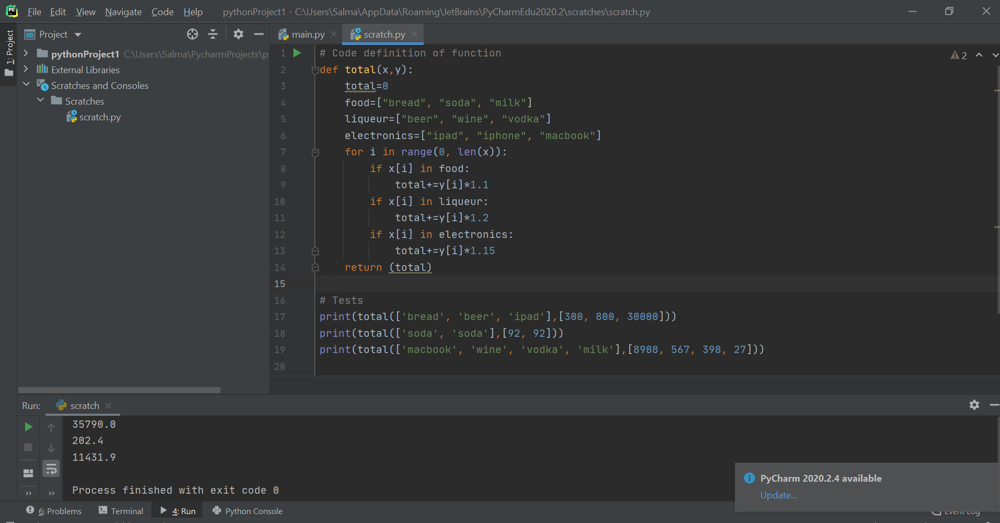

# Quiz 13
 <br>
 <br>
 <br>
```py
# Code definition of function
def total(x,y):

    total=0
    food=["bread", "soda", "milk"]
    liqueur=["beer", "wine", "vodka"]
    electronics=["ipad", "iphone", "macbook"]

    for i in range(0, len(x)):
        if x[i] in food:
            total+=y[i]*1.1
        elif x[i] in liqueur:
            total+=y[i]*1.2
        elif x[i] in electronics:
            total+=y[i]*1.15
        else:
            new_category=input("the item {} is not found. Please indicate category: food, liqueur, electronics here -> ".format(x[i]))
            if new_category=="food":
                food.append(x[i])
                total+=y[i]*1.1
            elif new_category=="liqueur":
                liqueur.append(x[i])
                total+=y[i]*1.2
            elif new_category=="electronics":
                electronics.append(x[i])
                total+=y[i]*1.15

    return (total)

# Tests
print(total(['bread', 'beer', 'ipad'],[300, 800, 30000]))
print(total(['soda', 'soda'],[92, 92]))
print(total(['macbook', 'wine', 'vodka', 'milk'],[8908, 567, 398, 27]))
print(total(['apple', 'soda'],[100, 92]))
```
