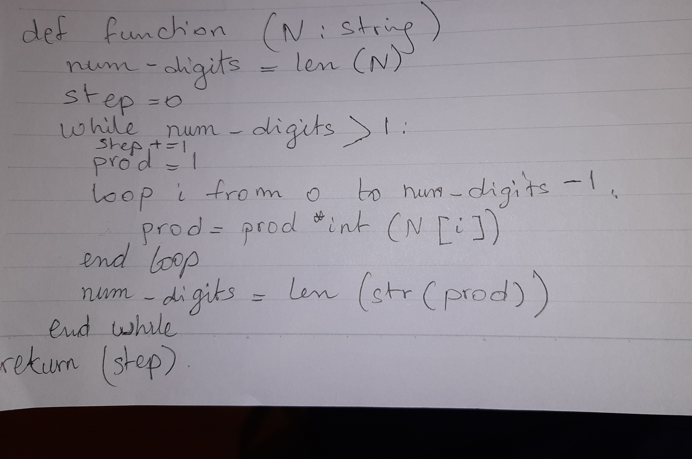

# Quiz 17
 <br>
```py
def givesteps(n :str):
    num_digits = len(n)
    step: int=0
    prod = 1
    while num_digits>1:
        step += 1
        for i in range(0, num_digits-1):
            prod = prod*int(n[i])
            num_digits=len(str(prod))
    return step

#Testing
print(givesteps("390"))
```
